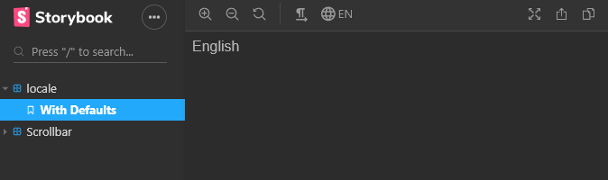

# storybook-addon-locale

A storybook addons that lets you select locale from the list.



## Installation

Install the following npm module:

```sh
npm i --save-dev storybook-addon-locale
```

or with yarn:

```sh
yarn add -D storybook-addon-locale
```

Then, add following content to .storybook/addons.js

```js
import 'storybook-addon-locale/register';
```

## Configuration

Following options are available:

- locales
- defaultLocale
- enableLocaleLockButton

Set addon options in your `config.js` file.

### locales

```js
import { addParameters } from '@storybook/react';

addParameters({
  locales: ['en', 'fr'],
  defaultLocale: 'en'
});
```

This options can also take object of data:

```js
import { addParameters } from '@storybook/react';

addParameters({
  locales: {
    en: { dir: 'ltr', name: 'English', text: 'English' },
    fa: { dir: 'rtl', name: 'Persian', text: 'فارسی' }
  }
});
```

> To apply ltr-rtl direction to the story, the [storybook-rtl-addon](https://www.npmjs.com/package/storybook-rtl-addon) must be installed. and `dir` prop must be provided as it shown above.

Or inside story file:

```js
export default {
  component: MyComponent,
  parameters: { locales: ['en', 'fr'] },
  title: 'locale test'
};
```

Or for specific story:

```js
MyComponentStory.story = {
  parameters: {
    locales: ['en', 'fr']
  }
};
```

> To disable locale for specific stroy set `locale` to false as follow:

```js
MyComponentStory.story = {
  parameters: {
    locales: false
  }
};
```

### defaultLocale

To set default local storybook:

```js
import { addParameters } from '@storybook/react';

addParameters({
  locales: ['en', 'fr'],
  defaultLocale: 'en'
});
```

Or inside story file:

```js
export default {
  component: MyComponent,
  parameters: { defaultLocale: 'en' },
  title: 'locale test'
};
```

### enableLocaleLockButton

To show a button in toolbar for locking selected locale for entire stories :

```js
import { addParameters } from '@storybook/react';

addParameters({
  locales: ['en', 'fr'],
  enableLocaleLockButton: true
});
```

## Story integration

This addon come with two type of hooks:

- useLocale
- useLocaleData

useLocale will return locale code:

```js
import { useLocale } from 'storybook-addon-locale';

function MyComponent(context) {
  const locale = useLocale(context);

  return (
    <div>
      {locale === 'en' && <div>English</div>}
      {locale === 'fr' && <div>French</div>}
    </div>
  );
}
```

useLocaleData will return locale data as an object:

```js
import { useLocaleData } from 'storybook-addon-locale';

function MyComponent(context) {
  const localeData = useLocaleData(context);

  return (
    <div>
      {localeData && localeData.locale === 'en' && <div>{localeData.text}</div>}
      {localeData && localeData.locale === 'fa' && <div>{localeData.text}</div>}
    </div>
  );
}
```

You can also listen for the locale change event as follow:

```js
import addons from '@storybook/addons';
import { LOCALE_EVENT_NAME } from 'storybook-addon-locale';

// get channel to listen to event emitter
const channel = addons.getChannel();

// create a component that listens for the event change
function MyComponent() {
  // this example uses hook but you can also use class component as well
  const [localeData, setLocale] = useState();

  useEffect(() => {
    // listen to change
    channel.on(LOCALE_EVENT_NAME, setLocale);
    return () => channel.off(LOCALE_EVENT_NAME, setLocale);
  }, [channel, setLocale]);

  return (
    <div>
      {localeData && localeData.locale === 'en' && <div>{localeData.text}</div>}
      {localeData && localeData.locale === 'fa' && <div>{localeData.text}</div>}
    </div>
  );
}
```
